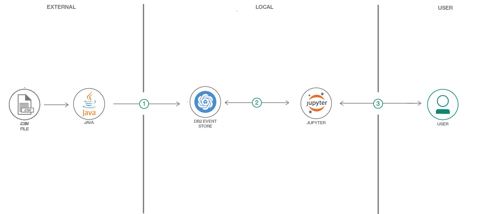
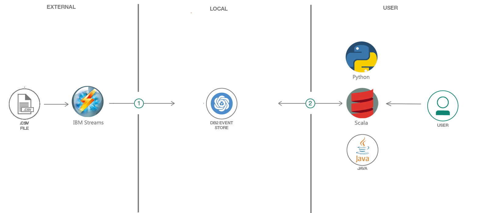

# IoT Sensor Temperature Analysis with IBM Db2 Event Store

> Note: This code pattern was developed and tested with IBM Db2 Event Store - Enterprise Edition 2.0. This code pattern is not compatible with older Event Store versions.

IBM® Db2® Event Store is a memory-optimized database designed for massive structured data volumes and real-time analytics. IBM Db2 Event Store combines open source technology (such as Spark and Zookeeper) with industry-tested enhancements from IBM (such as the IBM Common SQL Engine) to simplify your data landscape by enabling you to do real-time processing and batch processing with a single data store. IBM Watson® Studio Local is built into IBM Db2 Event Store for an integrated, collaborative development experience with support for creating machine-learning models. The solution is optimized for event-driven data processing and analysis. It can support emerging applications that are driven by events such as Internet of Things (IoT) solutions, payments, logistics and web commerce. It is flexible, scalable and can adapt quickly to your changing business needs over time. Available in a free developer edition and an enterprise edition that you can download now. The enterprise edition is free for pre-production and test, please visit the [official product webpage](https://www.ibm.com/products/db2-event-store) for more information.

The sample data used throughout this code pattern simulates the common data pattern collected by real industry IoT sensors. The IoT data sample consists of record timestamp, ambient temperature, power consumption, and sensor temperature record by a group of sensors identified with unique sensor IDs and device IDs. The advanced analytics and applications demostrated are also built on this same data set.

This code pattern contains two parts. The first part demonstrates a simple data load process and the use of a Jupyter notebook to interact with IBM Db2 Event Store, from the creation of the database objects to doing advanced analytics and machine learning model development and deployment. The second part demonstrates advanced usages, including ingesting data using IBM Streams, Apache Kafka and CSV files, and running external applications in multiple programming languages, like Python, Java and Scala. It also includes examples to demostrate the Db2 common client compatibility that is new in version 2.0, including a JDBC application written using the standard Db2 client JAR, and remote access using a standard Db2 client command line processor (CLP).

When the reader has completed this code pattern, they will understand how to:

* Ingest data into IBM Db2 Event Store
* Interact with Db2 Event Store using Python and a Jupyter notebook
* Perform online scoring using saved machine learning model through curl
* Interact with IBM Db2 Event Store through its REST API
* Interact with IBM Db2 Event Store through remote applications in Python, Scala and Java.
* Interact with IBM Db2 Event Store using standard Db2 client access patterns, like using the Db2 client JAR and the Db2 standard Command Line Processor (CLP) client.
* Run IBM Streams and Remote Access Applications with IBM Db2 Event Store

**Table of Contents**

- [IoT Sensor Temperature Analysis with IBM Db2 Event Store](#iot-sensor-temperature-analysis-with-ibm-db2-event-store)
  * [Abstract](#abstract)
  * [Included components](#included-components)
  * [Featured technologies](#featured-technologies)
  * [Prerequisites](#prerequisites)
- [Workflow](#workflow)
    + [1. Prepare sample IoT dataset](#1-prepare-the-sample-iot-dataset)
    + [2. Interact with IBM Db2 Event Store using Jupyter notebook](#2-interact-with-ibm-db2-event-store-using-jupyter-notebook)
    + [3. Interact with Event Store database using REST API](#3-interact-with-event-store-database-using-rest-api)
    + [4. Run Example IBM Streams and Remote Access Applications with Event Store](#4-run-example-ibm-streams-and-remote-access-applications-with-event-store)
- [Sample output](#sample-output)
- [Links](#links)
- [Learn more](#learn-more)
- [License](#license)

## Abstract

1. Setup a Event Store database and table
2. Perform multiple data science tasks with Event Store using Jupyter notebooks
3. Interact with Event Store database using REST API
4. Run example IBM Streams and Remote Access Applications with Event Store

## Included components

* [IBM Db2 Event Store](https://www.ibm.com/us-en/marketplace/db2-event-store): In-memory database optimized for event-driven data processing and analysis.
* [IBM Watson Studio Local](https://www.ibm.com/cloud/watson-studio): Analyze data using RStudio, Jupyter, and Python in a configured, collaborative environment that includes IBM value-adds, such as managed Spark.
* [Jupyter Notebook](http://jupyter.org/): An open source web application that allows you to create and share documents that contain live code, equations, visualizations, and explanatory text.
* [Python](https://www.python.org/): Python is a programming language that lets you work more quickly and integrate your systems more effectively.
* [Java](https://java.com/): A secure, object-oriented programming language for creating applications.
* [Scala](https://www.scala-lang.org/): Scala combines object-oriented and functional programming in one concise, high-level language.
* [IBM Streams](https://www.ibm.com/ca-en/marketplace/stream-computing): IBM® Streams® is an advanced stream processing platform that can ingest, filter, analyze and correlate massive volumes of continuous data streams, helping you make decisions while events are happening. 
* [Apache Kafka](https://kafka.apache.org/): Apache Kafka is an open source streaming platform that is able to publish and subscribe to streams of records, similar to a message queue or enterprise messaging system, store streams of records in a fault-tolerant durable way and process streams of records as they occur.

## Featured technologies
* [Databases](https://en.wikipedia.org/wiki/IBM_Information_Management_System#.22Full_Function.22_databases): Repository for storing and managing collections of data.
* [Analytics](https://developer.ibm.com/watson/): Analytics delivers the value of data for the enterprise.
* [Data Science](https://medium.com/ibm-data-science-experience/): Systems and scientific methods to analyze structured and unstructured data in order to extract knowledge and insights.

## Prerequisites

- Install IBM Db2 Event Store Enterprise Edition

The IBM Db2 Event Store Enterprise Edition is suggested to be installed in order to execute the examples in this repository. The Enterprise Edition is free for pre-production and test, you are welcomed to visit [official product webpage](https://www.ibm.com/products/db2-event-store) to get the Enterprise Edition for trial.

  > Note: This code pattern was developed with IBM Db2 Event Store - Enterprise Edition 2.0

- Clone this github repository to get a local copy of all files

Clone the `db2eventstore-IoT-Analytics` locally. In a terminal, run:

```bash
yum install -y git
git clone https://github.com/IBMProjectEventStore/db2eventstore-IoT-Analytics.git
```

- It is useful to perform an `oc login` to the OpenShift custer running Event Store.  This requires the `oc` client tool installed, which is typically done with the installatio of OpenShift.  If your linux machine does not have the `oc` binary installed, for CentOS 7 & 8 and Red Hat 7 & 8, run these as the commands as the `root` user to install it
```
cd $HOME
yum install -y wget
wget https://github.com/openshift/okd/releases/download/4.7.0-0.okd-2021-05-22-050008/openshift-client-linux-4.7.0-0.okd-2021-05-22-050008.tar.gz
tar -xzvf openshift-client-linux-4.7.0-0.okd-2021-05-22-050008.tar.gz  -C /usr/bin/
```
For Mac, Windows, & Linux here is a link to get the [`oc` client](https://github.com/openshift/okd/releases)

- **Strongly Recommended** Optionally build the client docker container to be able quickly have an environment ready to run all remote applications in this code pattern, by following the instructions in the [container folder in this repository](container). This sets up the environment to run all examples in this code pattern, including Python, Java, JDBC, ODBC, Scala, and even [Apache Kafka](https://github.com/IBMProjectEventStore/db2eventstore-kafka).

# Workflow

### 1. Prepare the sample IoT dataset

This repository includes a generator to create a sample IoT dataset in CSV format that contains 1 Million records. The sample CSV dataset can be found at `/data/sample_IOT_table.csv`.

Alternatively, a CSV dataset containing user-specified number of record can be generated with the provided python script at `/data/generator.py`. A Python environment with Pandas and Numpy installed is required to run the script.

```bash
cd data
python ./generator.py -c <Record Count>
```

### 2. Interact with IBM Db2 Event Store using Jupyter notebook



#### a. Load the notebooks in IBM Watson Studio Local

> Note: Db2 Event Store is integrated with IBM Watson Studio Local

The git repo includes five Jupyter Notebooks which demonstrate interacting with
Db2 Event Store with Spark SQL and multiple popular data science tools.

**Importing the Notebooks**

Use the Db2 Event Store / IBM Watson Studio Local UI to create and run the notebook.

1. From the drop down menu (three horizontal lines in the upper left corner), select `My Notebooks`.
2. Click on `add notebooks`.
3. Select the `From File` tab.
4. Provide a name.
5. Click `Choose File` and navigate to the `notebooks` directory in your cloned repo. Select the Jupyter notebook files with name pattern `*.ipynb`.
6. Scroll down and click on `Create Notebook`.
  The new notebook is now open and ready for execution.

#### b. Create IBM Db2 Event Store table with Jupyter notebook

Db2 Event Store table to be used throughout this code pattern can be created with one of the Jupyter notebooks provided once it is loaded to the IBM Watson Studio Local. 

1. Open the Jupyter notebook with name `Event_Store_Table_Creation.ipynb` from Db2 Event Store / IBM Watson Studio Local UI.
2. Edit the `HOST` constant in the first code cell. You will need to enter your host's IP address here.
3. Run the notebook using the menu `Cell > Run all` or run the cells individually with the play button.

#### c. Ingest sample data 

The sample IoT dataset can be ingested to the IBM Db2 Event Store table just created at lightning speed. This git repo provides several examples of how to do this load, from transfering the file into the cluster to do a [local load](data/load.sh), to using a remote [JDBC application](AdvancedApplications/JDBCApplication), and finally to doing a remote load using the [standard Db2 client](db2client_remote). 

In the example below we refer to the local load script, which is found under the data directory. This can be used to ingest the sample CSV dataset into the Event Store database with a single command when run from within the Db2 Event Store cluster. For more information on this, refer to the Db2 Event Store [Knowledge Center](https://www.ibm.com/support/knowledgecenter/en/SSGNPV_2.0.0/local/loadcsv.html). 

```
$ ./load.sh --namespace dsx
```

#### d. Run the data analytics notebooks

Run the notebooks below to learn how the IBM Db2 Event Store can be integrated with multiple popular scientific tools to perform various data analytics tasks.

**[Event_Store_Querying_on_Table.ipynb](notebook_with_result/Event_Store_Querying_on_Table.ipynb)**  
This notebook demonstrates best practices for querying the data stored in the IBM Db2 Event Store database. 

**[Event_Store_Data_Analytics.ipynb](notebook_with_result/Event_Store_Data_Analytics.ipynb)**
This notebook demonstrates performing data analytics on the data stored in the IBM Db2 Event Store database.

**[Event_Store_ML_Model_Deployment.ipynb](notebooks_with_result/Event_Store_ML_Model_Deployment.ipynb)**  
This notebook demonstrates building and deploying a machine learning model on the data stored in the IBM Db2 Event Store database. It also shows how to perform online scoring from command line using curl.

**[Advanced_Time_Series_Queries.ipynb](notebooks_with_result/Advanced_Time_Series_Queries.ipynb)**  
This notebook demonstrates the use of the time series capabilities that are new in Db2 Event Store 2.0. For a detailed documentation on this refer to the Db2 Event Store [Knowledge Center page](https://www.ibm.com/support/knowledgecenter/en/SSGNPV_2.0.0/com.ibm.swg.im.dashdb.analytics.doc/doc/timeseries_intro.html). 

**To run each notebook**

1. Open the notebooks from IBM Watson Studio Local UI.
2. Edit the `HOST` constant in the first code cell that is provided as input to the `ConfigurationReader.setConnectionEndpoints()` API. You will need to enter the connection string for your IBM Db2 Event Store deployment.
3. Run the notebook using the menu `Cell > Run all` or run the cells individually with the play button.

### 3. Interact with Event Store database using REST API

The instructions for running the REST API example can be found at: [Event Store REST API instruction](rest/README.md)

### 4. Run Example IBM Streams and Remote Access Applications with Event Store


The instructions for running the example IBM Streams application and the example remote access applications in Python, Java, Db2 JDBC, Scala can be found under the [AdvancedApplications folder](AdvancedApplications/README.md)

# Sample output

See the notebooks with example output here: [notebook examples with result](notebooks_with_result)

# Links
* [**Ingest and Analyze Streaming Event Data at Scale with IBM Db2 EventStore**](http://www.ibmbigdatahub.com/blog/ingest-and-analyze-streaming-event-data-scale-ibm-eventstore)
* [**Fast Data Ingestion, ML Equates to Smarter Decisions Faster**](https://www.ibm.com/blogs/think/2018/03/db2-event-store/)
* [**Overview of IBM Db2 Event Store Enterprise Edition**](https://www.ibm.com/support/knowledgecenter/en/SSGNPV_2.0.0/local/overview.html)
* [**Developer Guide for IBM Db2 Event Store Client APIs**](https://www.ibm.com/support/knowledgecenter/en/SSGNPV_2.0.0/develop/dev-guide.html)
* [**IBM Marketplace**](https://www.ibm.com/us-en/marketplace/db2-event-store)

# Learn more
* **IBM Watson Studio Local**: Master the art of data science with IBM's [IBM Watson Studio Local](https://www.ibm.com/cloud/watson-studio/)

# License
[Apache 2.0](LICENSE)

[IBM Db2 Event Store](https://www.ibm.com/products/db2-event-store)

